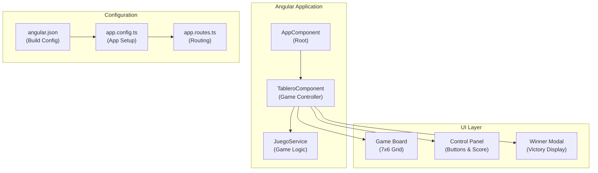
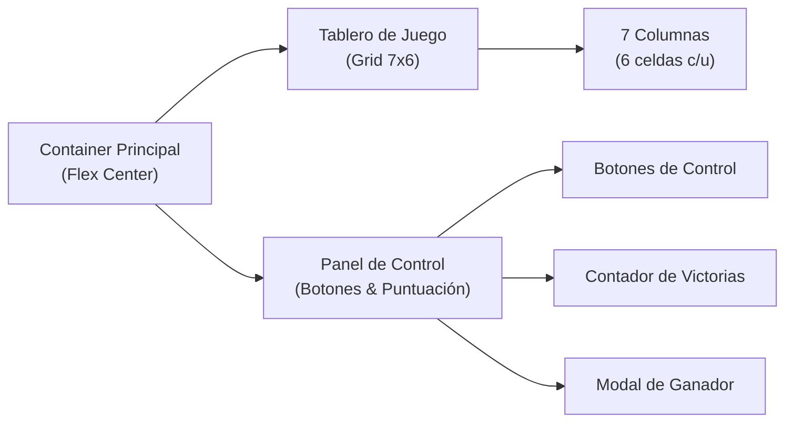
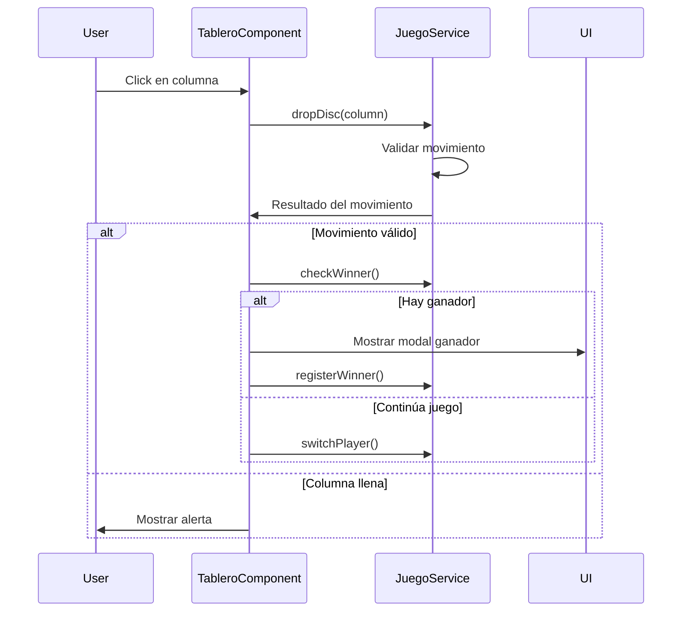

# Connect4 - Juego Angular

Una implementación completa del clásico juego Conecta 4 desarrollada en Angular con TypeScript, featuring una interfaz moderna y sistema de puntuación.

## 🎯 Descripción General

Connect4 es una aplicación web de una sola página (SPA) que implementa el juego clásico de Conecta 4. Los jugadores alternan turnos colocando fichas rojas y amarillas en un tablero de 7x6, con el objetivo de conectar cuatro fichas en línea horizontal, vertical o diagonal.

### Características Principales

- 🎮 Tablero interactivo de 7x6 celdas
- 🔴🟡 Dos jugadores (Rojo y Amarillo)
- 🏆 Sistema de puntuación persistente
- 🎵 Música de fondo y efectos de sonido
- ✨ Animaciones CSS para colocación de fichas
- 📱 Diseño responsivo con Tailwind CSS

## 🏗️ Arquitectura del Sistema



## ⚙️ Configuración del Proyecto

El proyecto utiliza Angular CLI con configuración estándar para desarrollo y producción.

### Configuraciones de Build

| Configuración | Propósito | Optimización |
|---------------|-----------|--------------|
| `development` | Desarrollo local | Deshabilitada |
| `production` | Despliegue | Habilitada con hashing | 

### Targets Disponibles

- **build**: Compilación de la aplicación
- **serve**: Servidor de desarrollo
- **test**: Ejecución de pruebas con Karma
- **extract-i18n**: Extracción de textos para internacionalización

## 📁 Estructura de Archivos

```
Connect4/
├── src/
│   ├── app/
│   │   ├── tablero/
│   │   │   ├── tablero.component.ts    # Controlador principal
│   │   │   ├── tablero.component.html  # Template del juego
│   │   │   └── tablero.component.css   # Estilos y animaciones
│   │   ├── juego.service.ts            # Lógica del juego
│   │   ├── app.config.ts               # Configuración de la app
│   │   └── app.routes.ts               # Rutas (vacías)
│   ├── assets/                         # Recursos estáticos
│   ├── index.html                      # Página principal
│   ├── main.ts                         # Punto de entrada
│   └── styles.css                      # Estilos globales
├── angular.json                        # Configuración del workspace
├── tsconfig.app.json                   # Config TypeScript
└── package.json                        # Dependencias
```

## 🎨 Interfaz de Usuario

La interfaz utiliza un diseño centrado con tema oscuro y componentes responsivos.

### Layout Principal



### Elementos Interactivos

1. **Tablero de Juego**: Grid de 7x6 con clic en columnas 
2. **Botones de Control**: 
   - Reiniciar Partida 
   - Resetear Puntajes 
3. **Contador de Puntuación**: Muestra victorias de cada jugador 

### Estados Visuales

| Estado | Clase CSS | Apariencia |
|--------|-----------|------------|
| Celda vacía | Default | Borde gris, fondo transparente |
| Ficha roja | `bg-red-500` | Fondo rojo |
| Ficha amarilla | `bg-yellow-500` | Fondo amarillo |
| Animación | `fall-animation` | Efecto de caída |

## 🎮 Sistema de Juego

El `TableroComponent` actúa como controlador principal del juego, manejando la interacción del usuario y coordinando con el `JuegoService`.

### Flujo de Interacción



### Manejo de Eventos

El componente maneja varios eventos de usuario:

1. **Clic en Columna**: Procesa el movimiento del jugador 
2. **Cerrar Modal**: Reinicia el juego después de una victoria 
3. **Reiniciar Juego**: Limpia el tablero manteniendo puntuación 
4. **Resetear Puntuación**: Limpia contadores de victorias 

### Sistema de Audio

La aplicación incluye música de fondo y efectos de sonido:

- **Música de Juego**: Loop continuo durante la partida 
- **Música de Victoria**: Se reproduce al ganar

## 🚀 Instalación y Ejecución

### Prerrequisitos

- Node.js (versión 16 o superior)
- npm o yarn
- Angular CLI

### Pasos de Instalación

```bash
# Clonar el repositorio
git clone https://github.com/HugoX2003/Connect4.git

# Navegar al directorio
cd Connect4

# Instalar dependencias
npm install

# Ejecutar en modo desarrollo
ng serve
```

La aplicación estará disponible en `http://localhost:4200`

## 📜 Scripts Disponibles

| Comando | Descripción |
|---------|-------------|
| `ng serve` | Servidor de desarrollo |
| `ng build` | Build de producción |
| `ng build --configuration development` | Build de desarrollo |
| `ng test` | Ejecutar pruebas |
| `ng extract-i18n` | Extraer textos para i18n |

### Configuraciones de Build

- **Desarrollo**: Sin optimización, con source maps
- **Producción**: Optimizado, con hashing de archivos, límites de bundle

## Notes
El proyecto utiliza Angular Signals para manejo reactivo del estado, Tailwind CSS para estilos, y una arquitectura de componente único que centraliza toda la lógica del juego. La aplicación no implementa routing ya que es una SPA simple con una sola vista de juego.
